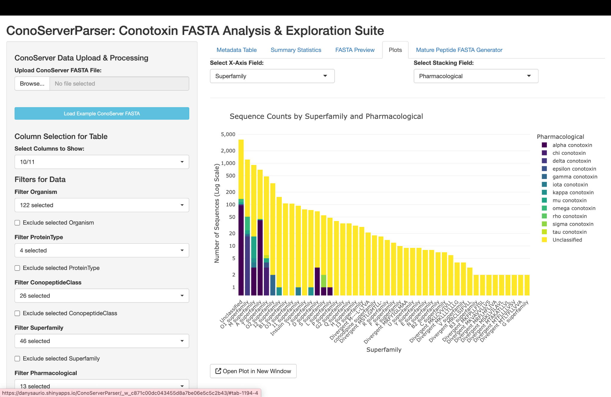

# 🧪 ConoServerParser: A Flexible Shiny Application for Filtering, Exploring, and Exporting Conotoxin Sequences from ConoServer

## Overview

[ConoServerParser is an R/Shiny application]([https://www.conoserver.org/index.php](https://danysaurio.shinyapps.io/ConoServerParser/)) designed to complement [ConoServer](https://www.conoserver.org/index.php) by addressing
practical limitations encountered when working with conotoxin sequence data.  Built for
researchers studying the diverse venom peptides produced by marine cone snails, ConoServerParser
streamlines the process of parsing interactively ConoServer’s pipe‑delimited FASTA headers, performing
metadata‑driven filtering and visualisation, and exporting customised sequence sets.

Conus snails (genus *Conus*) produce venom peptides known as conopeptides, which are highly
specific for ion channels and receptors.  This specificity makes
conotoxins invaluable for physiological studies and potential drug development.
With more than 700 *Conus* species and thousands of distinct peptides, conotoxin research spans
evolutionary biology and neurophysiology.  Conopeptides are classified into disulfide‑rich and disulfide‑poor peptides and categorised by pharmacological family, gene superfamily and cysteine framework.



Although ConoServer is a comprehensive resource, researchers often encounter practical limitations when preparing conopeptide data for downstream workflows. Retrieving sequences from ConoServer can introduce formatting errors in FASTA files and downstream prediction tools such as ConoPrec frequently fail to handle multi‑sequence inputs or export mature peptides as FASTA files. ConoServerParser addresses these challenges by providing reliable FASTA parsing, intelligent metadata extraction and customisable exports, making it easy to prepare clean datasets for further downstream analyses or as input for [complex biodiscovery pipelines](https://www.conoserver.org/index.php), and making it easier to handle metadata for tools such as [StarPep](https://doi.org/10.1093/bioinformatics/btad506), machine‑learning pipelines and other sequence analysis platforms.

The application is described in a [PagBiOmicS blog post](https://www.pagbiomics.com/blog/---conoserverparser--a-flexible-shiny-application-for-filtering--exploring--and-exporting-conotoxin-sequences-from-conoserver).
A video tutorial demonstrating how to use the app is also available on [YouTube](https://www.youtube.com/watch?v=ZgRrB305xRg).

### Key features

ConoServerParser brings together a suite of tools designed to make ConoServer data easier to
work with.  The application implements the capabilities described in the PagBioMicS article
and groups overlapping items where appropriate:

 - **FASTA parsing and metadata extraction** – Reliably interprets ConoServer’s
   pipe‑delimited headers to extract fields such as ConoID, species, gene superfamily,
   pharmacological family, cysteine framework and evidence level into a clean tabular
   format.
 - **Customisable FASTA export and header preview** – Allows you to construct new FASTA
   headers using selected metadata fields and custom delimiters, preview how the final
   headers will look and avoid oversized or unnecessary fields.  You can also group
   downloads by superfamily or pharmacological category and export grouped archives as
   ZIP files.
 - **Multi‑format table export** – Enables downloading of filtered sequence metadata tables
   in CSV, TSV or XLSX formats for downstream analysis.
 - **Mature peptide FASTA generation** – Automatically extracts and formats mature
   sequences from ConoPrec CSV outputs, overcoming the multi‑sequence limitations of
   downstream tools.
 - **Interactive filtering and exploration** – Provides an intuitive interface with
   dropdowns and search tools to select, filter and exclude sequences by any field
   (superfamily, pharmacological family, evidence level, etc.).
 - **Dynamic visual summaries and data visualisation** – Generates interactive bar plots
   comparing sequence distributions across superfamilies, pharmacological families or
   evidence types and other visualisations to summarise your data.

## Repository contents

This repository contains the source code and example data used by the Shiny app:

| File/folder | Description |
|---|---|
| `ConoServerParser.R` | Main Shiny application script. Running this file launches the app locally. |
| `ConoServerParser_precursors_2025-06-02.fasta` | Example FASTA file exported from ConoServer (dated 2025‑06‑02) containing a compilation of conotoxin precursor sequences.  Each header follows ConoServer’s pipe‑delimited format `identifier|name|organism|protein type|toxin class|gene superfamily|cysteine framework|pharmacological family|evidence`, mirroring the format used by the database. |
| `data/` | Contains auxiliary data files used by the application. |
| `data/conoserver_protein.fa` | Decompressed FASTA file containing the full set of ConoServer protein sequences (downloaded from the `conoserver_protein.fa.gz` archive).  Included for demonstration purposes and to illustrate how the app handles bulk sequence datasets. |
| `data/Y_superfamily.csv` | Sample dataset of conotoxin precursors belonging to the Y gene superfamily.  Columns include the signal peptide, propeptide (pre) region, mature region, post region, gene superfamily, cysteine framework, post‑translational modifications, a “Closest” sequence label and percentage identity.  This dataset demonstrates how ConoServerParser can filter, summarise and export complex metadata. |

Deployment‑specific files (`rsconnect/`) and temporary files (`.RData`, `.Rhistory`, `.DS_Store`) are
omitted from this repository to keep it clean and portable.

## Running the application

To run ConoServerParser locally you will need a recent version of **R** (≥ 4.x) and the
packages listed below.  Launching the app opens a web browser window with the Shiny user
interface.

1. Install the required R packages:

   ```r
   install.packages(c(
     "shiny", "tidyverse", "data.table", "Biostrings", "plotly", 
     "readxl", "openxlsx"
   ))
   ```

2. Clone this repository and set your working directory to its root:

   ```bash
   git clone https://github.com/<your‑username>/ConoServerParser.git
   cd ConoServerParser
   ```

3. Launch the app from within R:

   ```r
   shiny::runApp("ConoServerParser.R")
   ```

4. Use the sidebar controls in the web interface to upload ConoServer FASTA files, adjust
   filters, explore sequence distributions, and export customised FASTA or tabular files.

## Online application

If you prefer not to run the app locally, a hosted version is available at
[ConoServerParser on shinyapps.io](https://danysaurio.shinyapps.io/ConoServerParser)
(availability may vary depending on usage limits).

## References

The following sources provide background information and should be cited when using
ConoServerParser in your research:

- **Dany Domínguez Pérez – PagBiOmicS Blog (Jun 12 2025):** *ConoServerParser: A Flexible Shiny Application for Filtering, Exploring, and Exporting Conotoxin Sequences from ConoServer*. Available at: https://www.pagbiomics.com/blog/---conoserverparser--a-flexible-shiny-application-for-filtering--exploring--and-exporting-conotoxin-sequences-from-conoserver. See also the [video tutorial](https://www.youtube.com/watch?v=ZgRrB305xRg) for a demonstration of the app.
- Kaas Q, Yu R, Jin AH, Dutertre S, Craik DJ. (2012). ConoServer: updated content, knowledge, and discovery tools in the conopeptide database. *Nucleic Acids Research*, 40(Database issue): D325–D330.
- Kaas Q, Westermann JC, Halai R, Wang CK, Craik DJ. (2008). ConoServer, a database for conopeptide sequences and structures. *Bioinformatics*, 24(3): 445–446.
- **ConoServer database:** https://www.conoserver.org/ (accessed May 20 2025).
- **Intrathecal Pain Management**. (2023). In *Pain Management: Anesthesia, Analgesia, and Opioid Alternatives*.
- Agüero‑Chapin G., Domínguez‑Pérez D., Marrero‑Ponce Y., Castillo‑Mendieta K., Antunes A. (2024). *Unveiling encrypted antimicrobial peptides from Cephalopods’ salivary glands: a proteolysis‑driven virtual approach*. **ACS Omega**, 9(43), 43353–43367. https://doi.org/10.1021/acsomega.4c01959.
- Aguilera‑Mendoza L., Ayala‑Ruano S., Martinez‑Rios F., Chavez E., García‑Jacas C. R., Brizuela C. A., Marrero‑Ponce Y. (2023). *StarPep Toolbox: an open‑source software to assist chemical space analysis of bioactive peptides and their functions using complex networks*. **Bioinformatics**, 39(8), Article btad506. https://doi.org/10.1093/bioinformatics/btad506.

## License

This software is provided under an open‑source licence.  Feel free to modify and adapt the
app for academic or non‑commercial use; please attribute the original author when
distributing derivative works.
